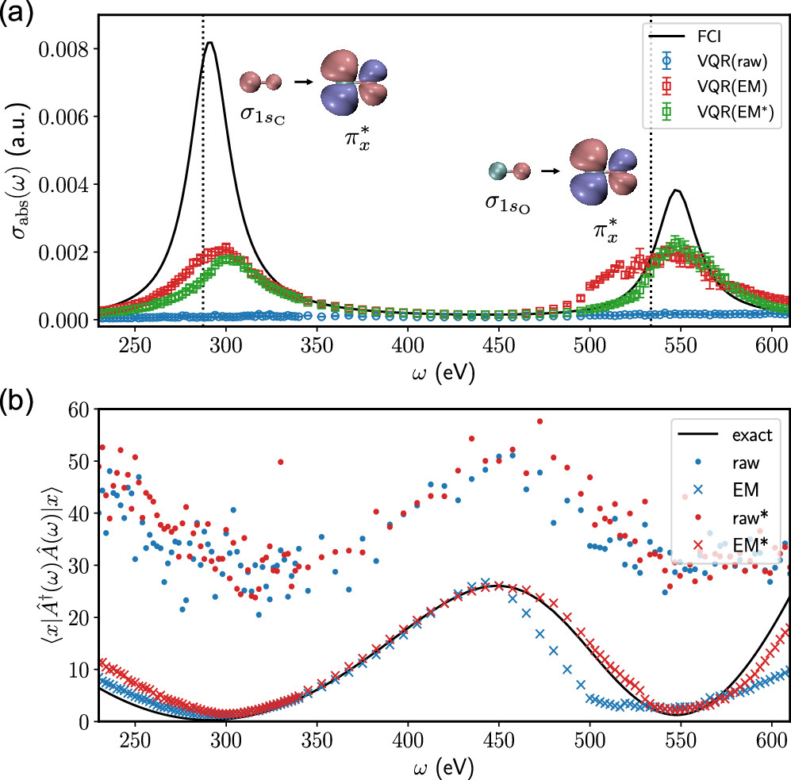
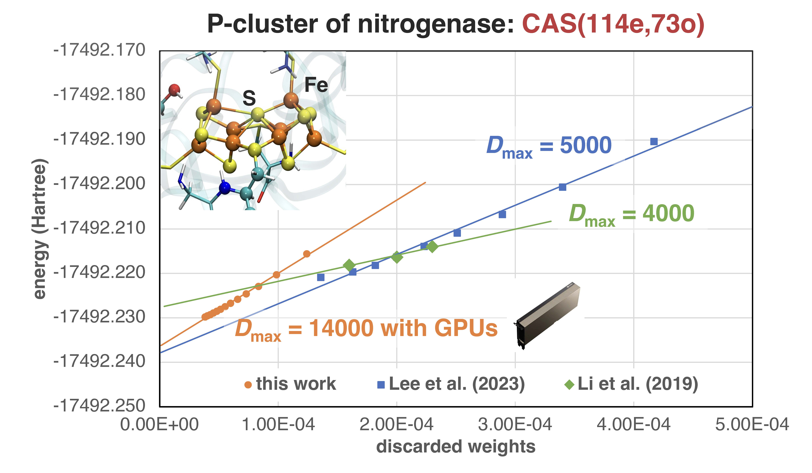

Chemical systems with transition metal centers have fascinating functionalities in catalysis and illuminessence. However, these systems remain difficult to be studied computationally. From the electronic structure aspect, the main theoretical challenges involve:

**1. Strong correlation**: requiring efficient methods for large active space (~100 d/f orbitals)
**2. Dynamic correlation**: requiring nonperturbative methods beyond MRPT2 for chemical accuracy
**3. Excited states**: requiring a balanced treatment for different types of excitations (local and delocalized)
**4. Spectroscopies**: requiring relativistic effects in particular spin-orbit couplings (EPR/X-ray/Mössbauer)
**5. Environments**: requiring the ability to handle large systems

We are interested in developing new electronic methods for describing these strongly correlated systems in chemistry based on new insights and technologies from condense matter physics, artificial intelligence, and quantum computing. If you find it interesting and exciting, you can find our articles on [Google Scholar profile](https://scholar.google.com/citations?user=MYZZUJ0AAAAJ&hl=en). Topics we are currently working on includes:

## 1. Quantum algorithms for electronic structure problems

We are the first to develop quantum algorithms for molecular response properties[1] and perform real experimental simulation of molecular absorption spectra on quantum hardware[2].

Reference:

1. X. Cai, W.-H. Fang, H. Fan, Z. Li, Phys. Rev. Res. 2, 033324 (2020)

2. K. Huang, et al. J. Phys. Chem. Lett. 13, 9114-9121 (2022) 

## 2. High performance computing for strong electron correlation

We developed the first distributed multi-GPU ab initio DMRG algorithm[1], and proposed an efficient relativistic DMRG algorithm using time-reversal symmetry[2].

Reference:

1. C. Xiang, W. Jia, W.-H. Fang, Z. Li, arXiv:2311.02854

2. Z. Li, J. Chem. Phys. 158, 044119 (2023)

## 3. Unconventional wavefunction ansatz inspired from neural networks

Coming soon

## 4. Novel methods for strong correlation based on locality

Coming soon

