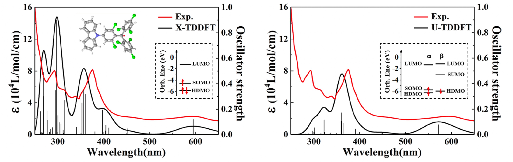

Chemical systems with transition metal centers have fascinating functionalities in catalysis, illuminessence, and quantum information science. However, these systems are extremely challenging for computational studies. From the electronic structure aspect, the main theoretical bottlenecks involve:

**1. Strong correlation**: requiring efficient methods for large active space (~100 d/f orbitals)

**2. Dynamic correlation**: requiring nonperturbative methods beyond MRPT2 for chemical accuracy

**3. Excited states**: requiring a balanced treatment for different types of excitations (local and delocalized)

**4. Spectroscopies**: requiring relativistic effects in particular spin-orbit couplings (EPR/X-ray/Mössbauer)

**5. Environments**: requiring the ability to handle large systems

In our group, we develop new methods and computational tools for dealing with these strongly correlated systems in chemistry based on new insights and technologies from other areas, such as condense matter physics, artificial intelligence, and quantum computing. If you find this interesting and exciting, you can find our articles on [Google Scholar profile](https://scholar.google.com/citations?user=MYZZUJ0AAAAJ&hl=en). Topics we are currently working on include:

## Strong correlation: novel ans&auml;tze and hardware

### Tensor networks and high performance computing

We are interested in exploring tensor network states (TNS) beyond matrix product states such as comb TNS[1] and those hybridized with neural networks. We proposed an efficient relativistic DMRG algorithm using time-reversal symmetry[2], and developed the first distributed multi-GPU parrallelized ab initio DMRG algorithm[3]. These powerful tools will lead to quantitative accuracy for polynuclear transition metal complexes[4] using the state-of-the-art AI hardware. 

**Reference**:

1. Z. Li, Electron. Struct. 3, 014001 (2021)

2. Z. Li, J. Chem. Phys. 158, 044119 (2023)

3. C. Xiang, W. Jia, W.-H. Fang, Z. Li, J. Chem. Theory Comput. 20, 775-786 (2024)

4. Z. Li, S. Guo, Q. Sun, G. K.-L. Chan, Nat. Chem. 11, 1026 (2019)

### Quantum algorithms for electronic structure problems

We are the first to develop quantum algorithms for molecular response properties[1] and performed real experimental simulation of molecular absorption spectra on quantum hardware[2]. We are interested in designing new efficient quantum wavefunction ansatz[3] for studying multi-configurational problems using quantum computers[4].

**Reference**:

1. X. Cai, W.-H. Fang, H. Fan, Z. Li, Phys. Rev. Res. 2, 033324 (2020)

2. K. Huang, et al. J. Phys. Chem. Lett. 13, 9114-9121 (2022) 

3. X. Xiao, et al. J. Chem. Theory Comput. 20, 1912-1922 (2024)

4. S. Zhao, et al. J. Phys. Chem. Lett. 15, 7244-7253 (2024)

## Dynamical correlation: diagrammatic multi-reference methods

We developed a generalized many-body perturbation theory (MBPT), which bridges standard MBPT in condense matter physics with multi-reference perturbation theory in quantum chemistry[1]. Using this framework, we formulated a multi-reference random phase approximation (MR-RPA) thorough diagrammatic resummation, which resums conventional ring diagrams and those including local insertion of two-body connection Green's functions/cumulants. This is an extension of our previous work on stochastic MBPT[2], which uses time-dependent diagrammatic formulation and Monte Carlo algorithm to compute high-order corrections.

**Reference**:

1. Y. Wang, W.-H. Fang, Z. Li, arXiv:2410.22990 (2024)

2. Z. Li, J. Chem. Phys. 151, 244114 (2019)

## Excited states: spin-adapted open-shell time-dependent DFT

We developed spin-adapted time-dependent density functional theory (X-TD-DFT) for excited states of open-shell systems, which overcomes the excited-state spin contamination problem due to the incompleteness of excited configuration manifolds using tensor couplings[1]. We formulate the ways to include spin-orbit couplings[2] and define nonadiabatic couplings[3] within this framework. We are working on extending it to nonadiabatic dynamics of large open-shell molecules.

**Reference**:

1. Z. Li and W. Liu, J. Chem. Phys. 133, 064106 (2010)

2. Z. Li, B. Suo, Y. Zhang, Y. Xiao, and W. Liu, Mol. Phys. 111, 3741 (2013)

3. Z. Li and W. Liu, J. Chem. Phys. 141, 014110 (2014)

